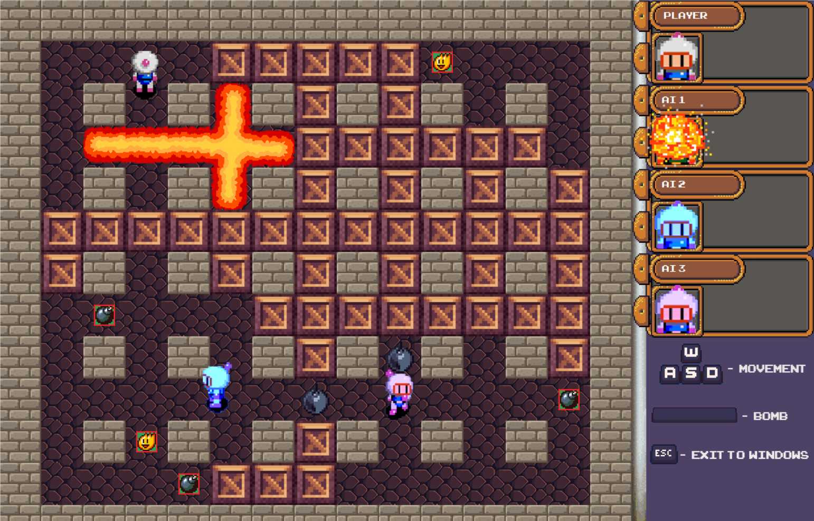

# Bomberman
Made as a school project

# Credits

Player sprites - Manalu Nakanishi (https://manalun.github.io/)

Victory screen (edited) - Bryce (AIBryce) Corbett (https://www.deviantart.com/aibryce)

Powerup sprites - Power Bomberman fangame (http://www.bombermanboard.com/viewtopic.php?t=1925)

Start menu - https://wallpaperaccess.com/

Explosion sprites - Satik64 (https://opengameart.org/users/satik64)

Scoreboard sprites - Buch (https://opengameart.org/users/buch)

Keyboard sprites - @Hyohnoo (https://hyohnoo.itch.io/)

Victory sound - Joshua Empyre (https://freesound.org/people/joshuaempyre/sounds/404024/)
Main menu music - Joshua Empyre (https://freesound.org/people/joshuaempyre/sounds/251461/)

Menu select sound - pumodi (https://freesound.org/people/pumodi/sounds/150222/)

Bomb placement sound - Lukeo135 (https://freesound.org/people/Lukeo135/sounds/540728/)

Player death sound - jackkech (https://freesound.org/people/jeckkech/sounds/391655/)

Explosion sound - OwlStorm (https://freesound.org/people/OwlStorm/sounds/404742/)

Game soundtrack - Decktonic - Night Drive (Strong Suit Remix) (https://freemusicarchive.org/music/Strong_Suit/Simulation/13_Decktonic_-_Night_Drive_Strong_Suit_Remix)